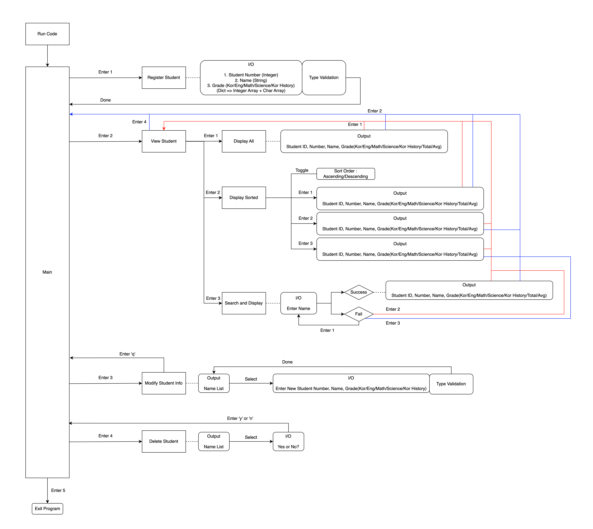

# Student Grade Management System

A terminal-based student grade management system developed in C using the ncurses library.

## Overview

This is a simple terminal-based program for managing student grades. It provides basic functionality to register students, input grades for five subjects, and view the results in various formats through an interactive text interface.

## Features

- **Student Registration**: Add new students with their basic information and grades
- **Grade Management**: Manage grades for five subjects (Korean, English, Math, Science, Korean History)
- **Automatic Grading**: Converts numeric scores to letter grades (A-F scale)
- **Multiple Display Options**:
  - View all students
  - Sort by name, student number, or total score
  - Search functionality
- **Student Information Management**:
  - Modify existing student information
  - Delete student records
- **Interactive UI**: Keyboard navigation with arrow keys and Enter selection

## Technical Specifications

### Subjects
- Korean
- English  
- Math
- Science
- Korean History

### Grading Scale
- A: 90-100 points
- B: 80-89 points
- C: 70-79 points
- D: 60-69 points
- F: Below 60 points

### System Limits
- Maximum students: 100
- Number of subjects: 5 (fixed)

## Prerequisites

- GCC compiler
- ncurses library

### Installing ncurses

**Ubuntu/Debian:**
```bash
sudo apt-get install libncurses5-dev libncursesw5-dev
```

**macOS (Homebrew):**
```bash
brew install ncurses
```

## Compilation

```bash
gcc -o grade_system c_prj.c -lncurses
```

## Usage

Run the compiled program:
```bash
./grade_system
```

### Navigation
- Use **arrow keys** to navigate through menu options
- Press **Enter** to select an option
- Follow on-screen instructions for data input

### Main Menu Options
1. **Register Student**: Add a new student with grades
2. **View Students**: Display student information with various sorting options
3. **Modify Student Info**: Edit existing student records
4. **Delete Student**: Remove a student from the system
5. **Exit Program**: Close the application

## Project Structure

```
.
├── c_prj.c          # Main source code
├── figures/
│   ├── figure_1.png # System architecture diagram
│   └── figure_2.mov # Demo video
└── README.md        # Project documentation
```

## Architecture

The system architecture and data flow can be viewed in the included diagram:



## Demo

A demonstration of the system in action is available:


## Data Structure

The program uses a struct to store student information:

```c
typedef struct {
    int id;                          // Internal ID
    int student_number;              // Student number
    char name[50];                   // Student name
    int grades[NUM_SUBJECTS];        // Numeric grades
    char letter_grades[NUM_SUBJECTS]; // Letter grades (A-F)
    int total_score;                 // Sum of all grades
    double average;                  // Average score
} Student;
```
